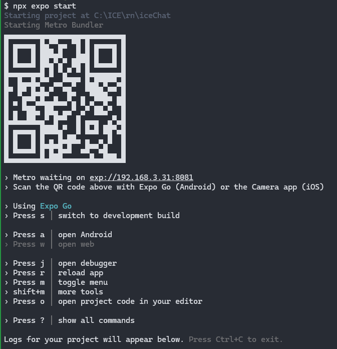

# rn环境安装

直接使用react native cli需要进行复杂的环境配置，这里推荐使用框架expo进行环境搭配，expo提供了一个开发环境，不需要进行复杂的环境配置，直接使用expo进行开发即可。

## 安装
```bash
npx create-expo-app my-app
```
由于默认创建的项目包含了很多我们不需要的插件，所以可以添加--template blank来创建一个空项目。

```bash
npx create-expo-app my-app --template blank
```
## 启动
同样不是用npm run android/ios来启动项目，而是使用expo start来启动项目。
启动后会打开一个浏览器窗口，在窗口中可以查看项目的运行情况，也可以使用expo go来在手机上查看项目的运行情况。
```bash
npx expo start
```
结果如下


在手机上安装expo go应用，扫描二维码即可在手机上查看项目的运行情况。
<!--  -->


<!-- When the article is ready for publication, you can update the "draft" field to "false" in the Frontmatter: -->

<!-- ```markdown
---
title: Draft Example
published: 2024-01-11T04:40:26.381Z
tags: [Markdown, Blogging, Demo]
category: Examples
draft: false
--- -->
